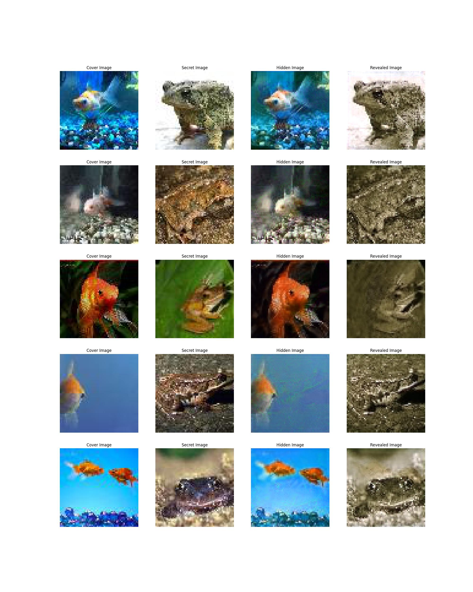

# Image Steganography Using Deep Learning

This project aims to utilize the power of Deep Learning to perform Image Steganography, which is the art of hiding secret information within a cover image. The project employs a simple Convolutional Neural Network (CNN) architecture, implemented in TensorFlow, to hide a secret image inside a cover image, resulting in an encoded image. This encoded image can then be decoded using a similar process to reveal the original secret image.

The model's training and validation processes output a set of four images, labeled as Cover Image, Secret Image, Hidden Image (encoded image), and Revealed Image (decoded image). The results/stego.jpg visualizes these images in a single snapshot shown below, facilitating understanding of the process.

- **Cover Image**: This is the original cover image that was used to hide the secret image.
  
- **Secret Image**: This is the original secret image that we tried to hide within the cover image.
  
- **Hidden Image**: This is the result of the encoder model. It's the cover image with the secret image hidden inside it.
  
- **Revealed Image**: This is what the decoder model produces. It's the secret image as revealed from the hidden image.


## Libraries

This project requires the following Python libraries:

- argparse
- matplotlib
- numpy
- Pillow
- tensorflow
- scikit-learn

To install these libraries, run the following command:

```bash
pip install -r requirements.txt
```

## Files and Folders

- `src/` : This folder contains the Python scripts for data preparation, model creation, and visualization.

- `src/data_preparation.py` : This script is responsible for loading and preparing the image data.

- `src/model.py` : This script is used to define the encoder and decoder models, as well as a combined model for training purposes.

- `src/visualize.py` : This script is used to visualize the process and output of the models.

- `train.py` : This is the main script to train the encoder and decoder models.

- `encode.py` : This script is used to encode a secret image into a cover image using the trained encoder model.

- `decode.py` : This script is used to reveal the secret image from an encoded image using the trained decoder model.

## Usage

1. **Training the model**

Use the `train.py` script to train the model. You need to provide paths to folders containing cover and secret images, the number of epochs, and the batch size for training.

```bash
python train.py --cv_path /path/to/cover_images/ --sc_path /path/to/secret_images/ --epochs 50 --batch_size 32
```

2. **Encoding an image**

Use the `encode.py` script to encode a secret image into a cover image. You need to provide paths to the cover image, secret image, and the trained encoder model.

```bash
python encode.py --cv_path /path/to/cover_image.jpg --sc_path /path/to/secret_image.jpg --encoder_path /path/to/encoder_model.h5
```

3. **Decoding an image**

Use the `decode.py` script to decode the secret image from an encoded image. You need to provide paths to the encoded image and the trained decoder model.

```bash
python decode.py --en_img_path /path/to/encoded_image.jpg --decoder_path /path/to/decoder_model.h5
```

## Results

The output images will be saved in the `results/` folder. For `train.py` and `encode.py`, the output will be saved as `results/stego.jpg` and `results/encoded_img.jpg` respectively. For `decode.py`, the output will be saved as `results/reveal_img.jpg`.


## Contributors
This project is developed by:

- Koushik Tripurari
- Dinesh Vennapoosa
- Sandeep Sirivuri
- Maddula Krishna Sai Prakash
  

## Contact
For any inquiries or questions, feel free to reach out to koushiktripurari1998@gmail.com
